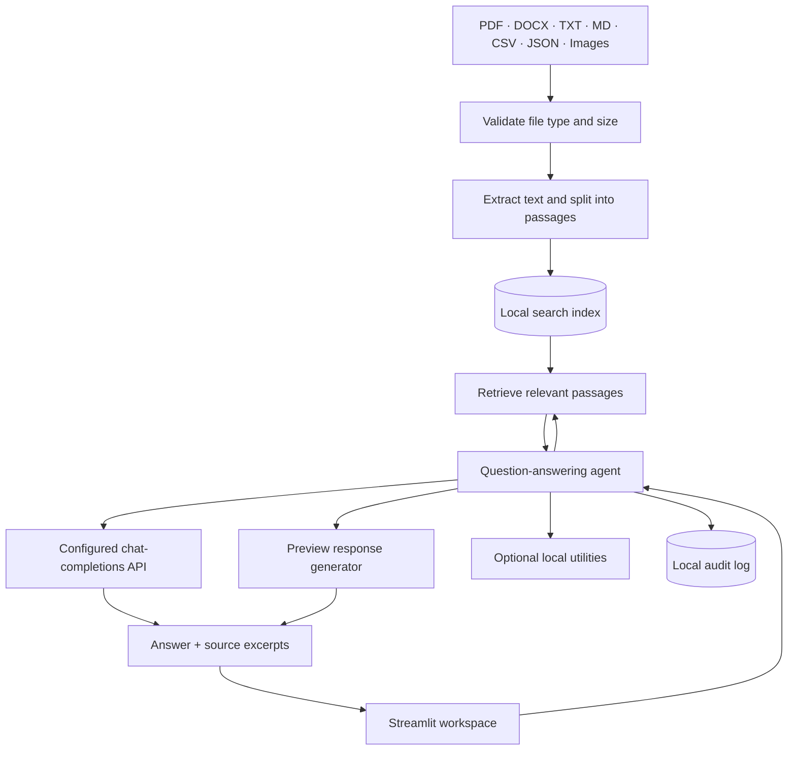

<p align="center">
  
</p>

<h1 align="center">Sovereign Workbench</h1>

<p align="center">
  <strong>Know the answer. Check the source.</strong><br />
  A focused workspace for asking questions about your documents and tracing answers back to evidence.
</p>

<p align="center">
  <a href="https://github.com/k-vandith/sovereign-agentic-ai-workbench/actions/workflows/tests.yml"></a>
  
  
  
  
</p>

---

## What is it?

Sovereign Workbench turns manuals, procedures, notes, and other supported files into a searchable knowledge space. Add your documents, ask a question, inspect the passages behind the answer, and export a compact report.

The interface stays focused on three places:

| Workspace | Documents | Settings |
|---|---|---|
| Ask questions and inspect source evidence | Upload, preview, index, and manage files | Configure an API and open advanced tools or audit details |

**Recommended for better answers:** connect an API provider that supports the OpenAI chat-completions format. The built-in preview mode is useful for testing file ingestion and retrieval, but it is template-based rather than a full reasoning model.

## Highlights

- **Source-backed answers** — open the retrieved excerpts and verify important details against the original file.
- **Multi-file uploads** — add PDFs, DOCX, TXT, Markdown, CSV, JSON, logs, and common image formats.
- **API-ready generation** — send the question and relevant retrieved passages to your configured API provider for answer generation.
- **Local document index** — retrieval and indexed passages are managed by the app on your machine.
- **Useful exports** — download an HTML answer report; PDF export is available when the optional report dependency is installed.
- **Advanced details stay tucked away** — inspect audit records or local tool activity from Settings when you need them, without filling the main workspace with dashboards.

## Architecture

The design separates document ingestion, retrieval, answer generation, and optional tools so each stage has a clear role.



**What happens during a question**

1. Documents are validated, extracted, split into passages, and added to the local search index.
2. Your question is matched against relevant passages.
3. In API mode, the question and those retrieved passages are sent to the provider you configured. In preview mode, the app uses its lightweight template-based generator instead.
4. The answer is shown with source excerpts so you can check the evidence. Local tool activity and audit events can be reviewed in Settings.

> **Data note:** API mode sends your question and relevant excerpts to the selected provider. Review that provider's data terms before indexing sensitive material. The app does not automatically encrypt the local data directory or provide multi-user authentication.

## Quick start

Python **3.11 or 3.12** is recommended.

### Windows · PowerShell

```powershell
git clone https://github.com/k-vandith/sovereign-agentic-ai-workbench.git
cd sovereign-agentic-ai-workbench

python -m venv .venv
.venv\Scripts\Activate.ps1

python -m pip install --upgrade pip
pip install -r requirements-dev.txt
python run.py
```

### macOS · Linux

```bash
git clone https://github.com/k-vandith/sovereign-agentic-ai-workbench.git
cd sovereign-agentic-ai-workbench

python3 -m venv .venv
source .venv/bin/activate

python -m pip install --upgrade pip
pip install -r requirements-dev.txt
python run.py
```

Open **[http://127.0.0.1:8501](http://127.0.0.1:8501)**.

## Configure an API for stronger answers

1. Copy `.env.example` to a local file named `.env` in the repository root.
2. Set the backend to `openai_compatible` and set `OFFLINE_MODE=false`.
3. Enter the endpoint, API key, and model name from your chosen provider.
4. Restart Sovereign Workbench.

Example `.env` settings:

```dotenv
LLM_BACKEND=openai_compatible
OFFLINE_MODE=false
OPENAI_COMPATIBLE_BASE_URL=https://api.openai.com/v1
OPENAI_COMPATIBLE_API_KEY=your_api_key_here
OPENAI_COMPATIBLE_MODEL=your_model_name
```

The endpoint should support the OpenAI chat-completions format. The base URL can include `/v1`; the app normalizes the common base-URL formats before sending a request.

**Keep your API key private:** do not commit `.env`, put a key in source code, or paste it into an issue or screenshot. The repository's `.env.example` contains placeholders, not live credentials.

Without API configuration, the app remains useful for trying uploads and document retrieval, but preview answers are illustrative and may not reason over evidence like a full language model.

## Try it in five steps

1. Open **Workspace** and choose the fictional sample pack, or head to **Documents** to upload your own files.
2. Wait for the indexing results and confirm the files you need are available.
3. Return to **Workspace** and ask a concrete question about a procedure, maintenance task, or operating limit.
4. Open the source excerpts under the answer and compare them with the original document.
5. Expand **Export the latest answer** to download an HTML report or an available PDF report.

## Supported files and limits

| File types | Behavior |
|---|---|
| PDF | Extracts selectable text. Scanned pages need an OCR workflow. |
| DOCX | Extracts document paragraph text. |
| TXT, MD, CSV, JSON, LOG | Reads and indexes text content. |
| PNG, JPG, JPEG, WEBP, BMP | Can be uploaded; image contents are not automatically understood. Optional OCR can extract visible text. |

- **25 MB maximum per file**
- **100 MB maximum per upload batch**
- Raw upload copies are temporary and deleted after ingestion.
- Extracted passages, the search index, and audit records remain in the local data directory until cleared or deleted.
- Default retrieval uses CPU-friendly text hashing. Optional semantic embeddings may download model weights when enabled.

## Optional features

Run these commands from the repository root when you need the corresponding feature:

| Feature | Setup |
|---|---|
| PDF answer reports | `python -m pip install -e ".[reports]"` |
| OCR | `python -m pip install -e ".[ocr]"` and install the Tesseract executable separately |
| Browser screenshots | `python -m pip install -e ".[screenshots]"` then `python -m playwright install chromium` |

To start the optional API server separately, use `python run.py --api`; its health endpoint is available at **[http://127.0.0.1:8000/health](http://127.0.0.1:8000/health)**.

## Development checks

Install the development dependencies and run the same checks used in CI:

```bash
python -m pip install -r requirements-dev.txt
ruff check src tests app.py run.py
bandit -q -r src -ll
pip-audit -r requirements.txt --progress-spinner off
pytest -v
```

GitHub Actions runs the checks against Python 3.11 and 3.12.

## Project map

```text
src/
├── agent/       Question answering, tools, permissions, and audit
├── api/         FastAPI application and endpoints
├── config/      Environment-based settings
├── document/    Extraction, upload validation, and reports
├── llm/         API adapter and preview generator
├── retrieval/   Local search index and passage retrieval
└── ui/          Streamlit workspace and visual theme

data/sample/     Fictional example documents
docs/            Product logo and optional screenshot output
tests/           Agent, ingestion, retrieval, API, and UI smoke tests
```

## Security and limitations

- The local audit log may contain filenames, questions, answers, and tool outputs. Protect the data directory with operating-system permissions.
- A local role setting is not a substitute for authenticated access control.
- Retrieval can miss relevant passages, and generated answers can be incomplete or wrong. Verify safety-critical guidance against the original source and the responsible person.
- Do not commit real case files, sensitive documents, API keys, or generated local data.

---

<p align="center">
  <strong>Sovereign Workbench</strong><br />
  <sub>Focused workflow · Transparent sources · Your configured API</sub>
</p>

<p align="center">
  <a href="https://github.com/k-vandith/sovereign-agentic-ai-workbench">Repository</a> ·
  <a href="https://github.com/k-vandith/sovereign-agentic-ai-workbench/issues">Issues</a> ·
  <a href="LICENSE">MIT License</a>
</p>
